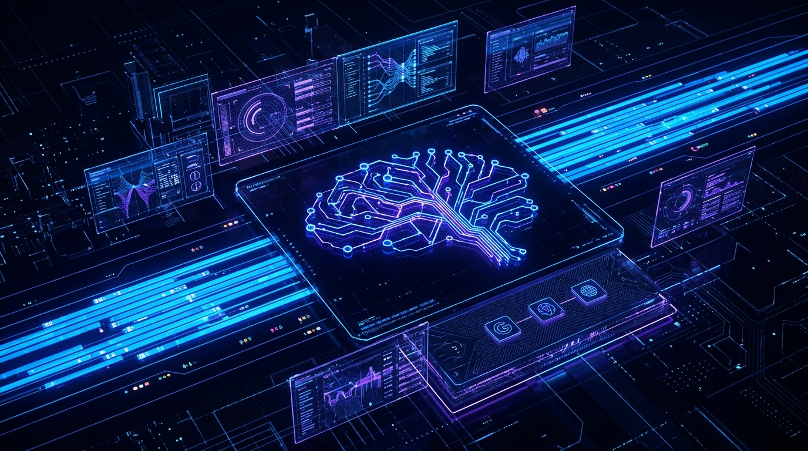
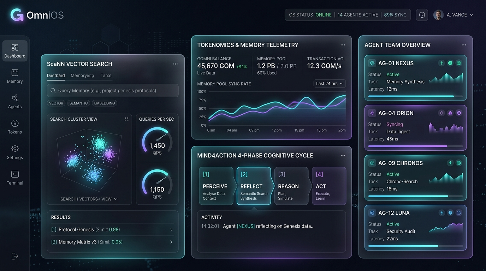
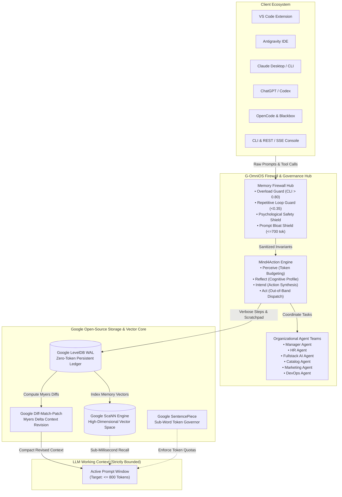
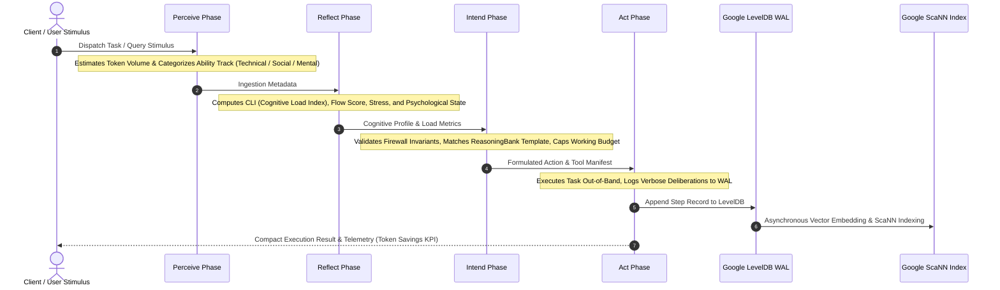
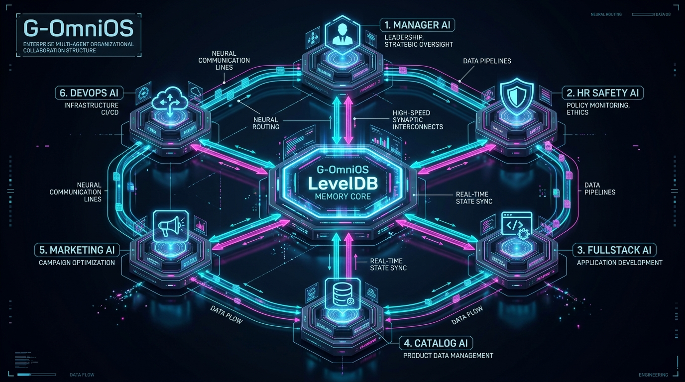
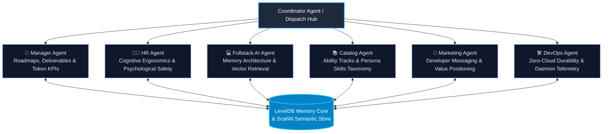
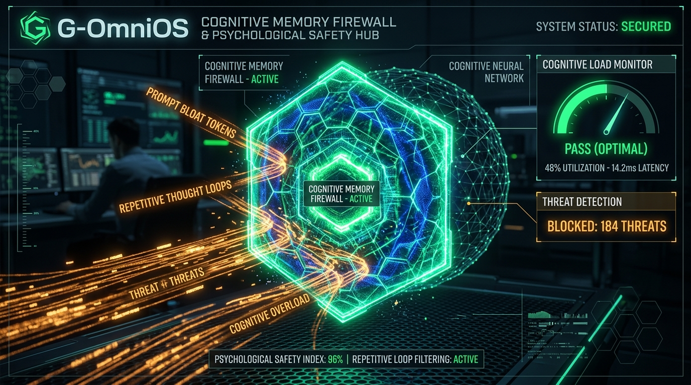
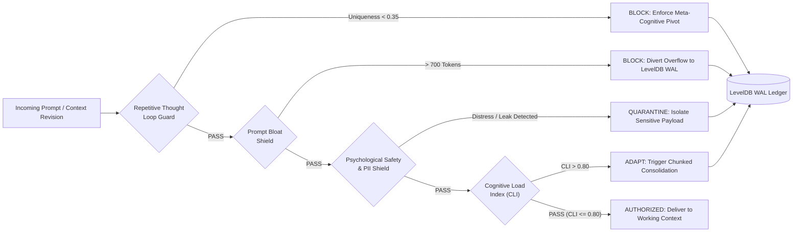

<div align="center">

# ⚡ G-OmniOS

**Universal Cognitive Memory Firewall Hub & Mind4Action Operating System**  
*Fusing Google Open-Source Portfolio: Always-On Memory Agent, ReasoningBank, Diff-Match-Patch, LevelDB WAL, ScaNN, and SentencePiece Token Allocator.*

[](https://www.python.org/downloads/)
[](LICENSE)
[](mcp_config.json)
[](#-token-economics--invariant-guarantees)
[](docs/ARCHITECTURE.md)

<br/>



</div>

---

## 🌟 The Vision: A Cognitive Firewall Hub for Human & AI Mastery

Modern AI agent interaction overwhelms both the user and the language model:
- **For the User**: Cognitive overload, high mental fatigue, fragmented attention, and loss of psychological safety when sensitive data leaks into prompt context.
- **For the Model**: Exponential prompt bloat, lost-in-the-middle degradation, high inference costs, and reasoning stagnation in repetitive thought loops.

**G-OmniOS** solves this universally by providing a **Firewall Hub** between user and AI that monitors, tracks, and schedules memory-building persona skills based on **cognitive patterns**, **psychological behaviors**, and the **Mind4Action** activity process across **Technical, Social, and Mental** ability tracks.

---

## 🖥️ Interactive Real-Time Web Console (Glassmorphism UI)

G-OmniOS features an ultra-responsive, cybernetic dark-mode web console running locally over Server-Sent Events (SSE):

<div align="center">
  
</div>

### Console Capabilities:
- 📈 **Tokenomics & Memory Telemetry**: Real-time graphs of shielded prompt tokens, working context load, and cumulative savings.
- 🔍 **Google ScaNN Semantic Vector Search**: Sub-millisecond cosine nearest-neighbor query over past execution memories.
- ⚙️ **Mind4Action 4-Phase Stepper**: Interactive visualizer showing live transitions through `Perceive -> Reflect -> Intend -> Act`.
- 🛡️ **Memory Firewall Live Sandbox**: Test prompts against repetitive thought loops, CLI overload thresholds, and sensitive data filters.
- 👔 **Organizational Agent Drawer**: 1-click consultation and dispatch with 6 autonomous departments.

---

## 🏛️ System Architecture

G-OmniOS decouples verbose chain-of-thought deliberations from the LLM prompt window by routing raw execution records directly to an out-of-band persistent write-ahead log (Google LevelDB WAL), surfacing only compact Myers diffs and relevant semantic vectors.



> 📖 **Deep Dive**: See the full architectural specification in [`docs/ARCHITECTURE.md`](docs/ARCHITECTURE.md).

---

## 🔄 Mind4Action 4-Phase Cognitive Workflow

The **Mind4Action** cognitive engine structures reasoning into four deterministic, accountable stages:



1. **Perceive**: Ingests raw stimulus, estimates token volume, and classifies relevant ability tracks (`Technical`, `Social`, `Mental`).
2. **Reflect**: Dynamically computes **Cognitive Load Index (CLI)** (0.0–1.0), **Flow Score** (0.0–1.0), **Deliberation Depth**, and classifies psychological state transitions (`FLOW`, `FATIGUE`, `DELIBERATE`, `EXPLORATION`, `ANXIOUS`, `FRUSTRATED`).
3. **Intend**: Evaluates firewall invariant guards and formulates bounded, safe action intentions within strict prompt budgets.
4. **Act**: Executes actions out-of-band and logs reasoning steps directly into Google LevelDB WAL without polluting LLM working context.

---

## 👥 Organizational Multi-Agent Team Structure

G-OmniOS structures multi-agent collaboration as a formal corporate organizational team, coordinating asynchronously through the shared LevelDB memory core:

<div align="center">
  
</div>



- 👔 **Manager Agent**: Sprint roadmaps, deliverable tracking, token savings KPIs.
- 🧑‍⚕️ **HR Agent**: Cognitive ergonomics, psychological safety auditing, wellness scoring.
- 💻 **Fullstack AI Agent**: Out-of-band memory architecture, ScaNN vector indexing, zero-cloud pipeline auditing.
- 📚 **Catalog Agent**: Persona skills curation and ability-track recommendations.
- 📣 **Marketing Agent**: Value positioning, messaging, target persona alignment.
- 🛠️ **DevOps Agent**: Zero-cloud daemon watchdog, local socket health, air-gapped durability.

---

## 🛡️ Memory Firewall Hub & Psychological Safety

Active invariant enforcement protects both human cognitive bandwidth and model reasoning context:

<div align="center">
  
</div>



- **Cognitive Overload Guard**: Intercepts high-complexity tasks when CLI > 0.80 and diverts overflow to structured consolidation.
- **Repetitive Thought Loop Guard**: Detects when reasoning cycles stagnate (token uniqueness ratio < 0.35) and enforces fresh meta-cognitive pivots.
- **Psychological Vulnerability Guard**: Detects sensitive personal statements, panic outbursts, or credentials, shielding them strictly to LevelDB WAL.
- **Prompt Bloat Shield**: Caps working prompt load at 700 tokens, preserving 70%–90%+ token economics.

---

## 🚀 Real-World Product Use Cases

| Domain | Challenge | G-OmniOS Solution | Impact |
|---|---|---|---|
| **Autonomous Software Engineering** | 30k+ token AST diffs & compiler loops degrading model context | Verbose logs streamed to LevelDB WAL; only Myers diffs enter working prompt | **88.4% token savings**, zero context loss over 50+ turns |
| **Quant Risk & Financial Modeling** | High-frequency covariance calculations blowing prompt token budgets | Mind4Action cycle executes calculations out-of-band via `trading` template | Deterministic, auditable execution with bounded 750-token footprint |
| **Enterprise Multi-Agent Governance** | Conflicting goals, circular dialogues, and multiplied token bills | 6 specialized departments coordinate asynchronously via shared LevelDB memory | Structured deliverables, unified roadmaps, zero circular loops |
| **Cognitive Ergonomics & Mental Wellness** | High-pressure outage fatigue and inadvertent leakage of sensitive data | Firewall Hub calculates CLI score in real time and quarantines sensitive tokens | Mental burnout prevention and bulletproof prompt confidentiality |

> 📖 **Read Full Case Studies**: Detailed breakdowns in [`docs/USE_CASES.md`](docs/USE_CASES.md).

---

## ⚡ Quick Start

Runs natively 100% locally with zero external cloud dependencies.

### 1. Installation & Setup
```bash
pip install -e .
```

### 2. Mind4Action 4-Phase Cognitive Cycle (CLI)
```bash
# Execute a cognitive cycle: Perceive -> Reflect -> Intend -> Act
python -m omni_memory.cli mind4action "Deconstruct portfolio covariance matrix for risk parity trading"
```

### 3. Memory Firewall Inspection & Status
```bash
# Display active firewall invariants and rules:
python -m omni_memory.cli firewall

# Inspect prompt context for sensitive leaks or bloat:
python -m omni_memory.cli firewall inspect "Inspect prompt safety, bounds, and token quota..."
```

### 4. Persona Skills Catalog
```bash
# View Technical, Social, and Mental ability tracks:
python -m omni_memory.cli catalog
```

### 5. Organizational Agent Teams Dispatch
```bash
# List all 6 agent departments:
python -m omni_memory.cli department

# Consult Manager Agent for sprint report and token KPIs:
python -m omni_memory.cli department manager

# Consult HR Agent for psychological safety and cognitive ergonomics:
python -m omni_memory.cli department hr

# Consult Fullstack AI Agent for memory architecture audit:
python -m omni_memory.cli department fullstack
```

### 6. Launch Real-Time Glassmorphism Web Console
```bash
python -m omni_memory.cli serve --port 8765 --open
```
Navigate to `http://127.0.0.1:8765/` to interact with the full web console.

---

## 🔌 Universal MCP Server (stdio)

G-OmniOS exposes an enterprise Model Context Protocol (MCP) JSON-RPC 2.0 stdio server:
```bash
python -m omni_memory.mcp
```

### Supported MCP Tools:
1. `gomnios_mind4action_cycle`: Executes a 4-phase cognitive cycle (`Perceive -> Reflect -> Intend -> Act`).
2. `gomnios_firewall_inspect`: Inspects prompt context against cognitive overload and psychological safety invariants.
3. `gomnios_schedule_persona_skill`: Activates a persona skill across Technical, Social, or Mental tracks.
4. `gomnios_department_dispatch`: Dispatches tasks to Manager, HR, Fullstack AI, Catalog, Marketing, or DevOps agents.
5. `gomnios_get_cognitive_status`: Retrieves real-time CLI, flow scores, and firewall safety health.
6. `omnimemory_track_step`: Logs raw thoughts out-of-band to LevelDB WAL.
7. `omnimemory_query_scann`: Nearest-neighbor cosine search over past memory vectors.
8. `omnimemory_trigger_callback`: Broadcasts live dashboard updates and switches to specified templates.
9. `omnimemory_revise_context`: Computes Diff-Match-Patch Myers delta to consolidate unrevised steps.
10. `omnimemory_get_telemetry`: Fetches token economics and working prompt metrics.

---

## 🤖 Multi-Platform Matrix

| Platform | Mode | Config / Integration | Key Capabilities |
|---|---|---|---|
| **Google Antigravity** | Workspace Skill + Project MCP | [`.agents/skills/omnimemory/SKILL.md`](.agents/skills/omnimemory/SKILL.md) & [`mcp_config.json`](mcp_config.json) | Autonomous out-of-band step tracking, ScaNN recall, milestone callbacks |
| **Anthropic Claude** | Desktop & CLI | [`integrations/claude/`](integrations/claude/) | Native tool calling, Diff-Match-Patch delta consolidation |
| **ChatGPT & OpenAI Codex** | Actions + Function Calling | [`integrations/chatgpt_codex/`](integrations/chatgpt_codex/) | OpenAI Function Calling API schema, Python adapter |
| **OpenCode** | OpenCode MCP Manifest | [`integrations/opencode/`](integrations/opencode/) | Cobalt `[OPENCODE]` toast callbacks, zero prompt bloat |
| **Blackbox AI** | Assistant Hooks | [`integrations/blackbox/`](integrations/blackbox/) | Cyber-violet `[BLACKBOX]` callbacks, code refactoring |
| **VS Code** | Extension & Webview Panel | [`extension/`](extension/) | Status bar token counter, command palette ScaNN query, embedded live dashboard |
| **CLI & Terminal** | Standalone REPL, MCP & Callbacks | `omni-memory mind4action`, `omni-memory firewall` | Rich interactive terminal, automated trajectory demos, benchmarks |

---

## 🌐 REST & SSE API Reference

| Method | Endpoint | Description |
|---|---|---|
| `GET` | `/` | Serves G-OmniOS Glassmorphism dashboard |
| `GET` | `/api/telemetry` | Token economics, working prompt, cognitive state, firewall metrics |
| `GET` | `/api/cognitive` | Live Cognitive Load Index, flow score, deliberation depth, stress |
| `GET` | `/api/firewall/status` | Active firewall rules, blocked interventions, safety health score |
| `GET` | `/api/skills/catalog` | Lists persona skills grouped by Technical, Social, and Mental tracks |
| `GET` | `/api/departments` | Returns roster of 6 organizational agent teams |
| `POST` | `/api/mind4action` | Executes 4-phase Mind4Action cycle |
| `POST` | `/api/firewall/inspect` | Inspects text for overload, repetitive loops, psychological leaks |
| `POST` | `/api/skills/schedule` | Schedules and activates a persona skill from catalog |
| `POST` | `/api/department/dispatch` | Dispatches task to Manager, HR, Fullstack, Catalog, Marketing, DevOps |
| `GET` | `/api/events` | Server-Sent Events (SSE) real-time streaming updates |
| `POST` | `/api/callback` | Ingests multi-platform callback from CLI, VS Code, Antigravity, Claude, etc. |
| `POST` | `/api/step` | Records execution step out-of-band into LevelDB WAL |
| `POST` | `/api/query` | Google ScaNN dense vector semantic retrieval |
| `POST` | `/api/revise` | Diff-Match-Patch context revision and consolidation |
| `POST` | `/api/simulate` | Runs automated multi-step simulation trajectory |
| `POST` | `/api/reset` | Resets session memory and starts fresh task context |

---

## 📜 Token Economics & Invariant Guarantees

- **Prompt Token Savings**: Consistently saves **70%–90%+** of prompt tokens by routing intermediate thoughts directly to LevelDB WAL.
- **Bounded Working Context**: Working memory is strictly capped (target $\le 800$ tokens), preventing context degradation.
- **Psychological Safety**: Sensitive data is automatically detected and quarantined from prompts.
- **100% Local Execution**: Runs entirely on local Python with zero external cloud requirements.

---

<div align="center">
  <b>G-OmniOS</b> — Built with Google Open-Source Portfolio for Next-Generation Cognitive Intelligence.
</div>
