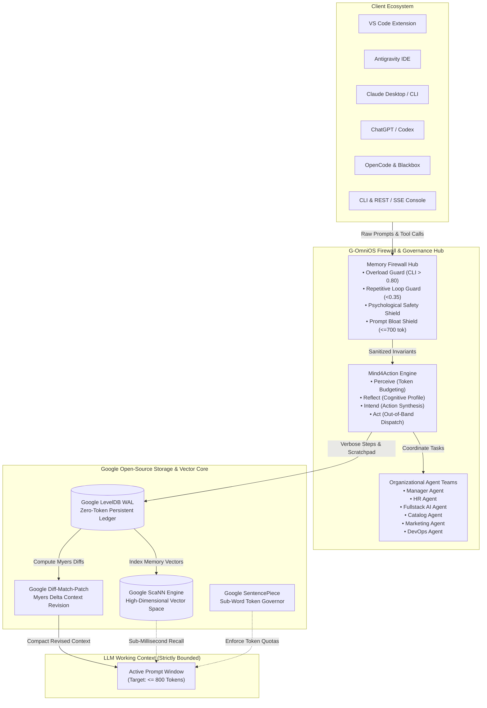
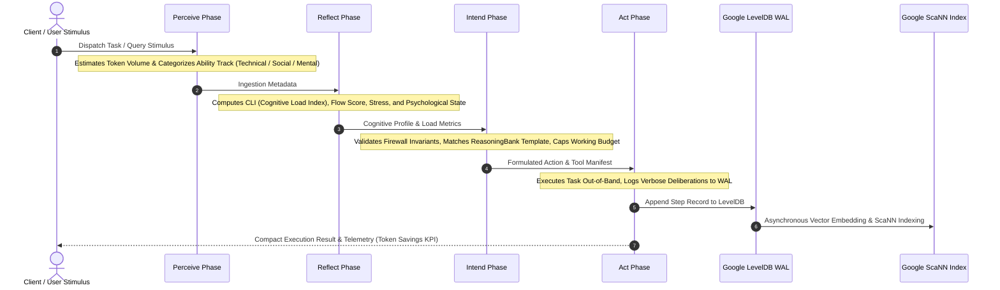
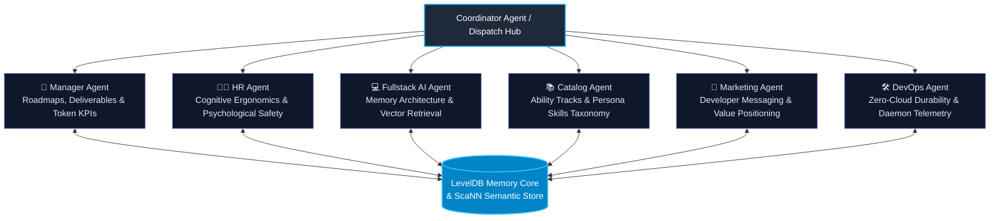
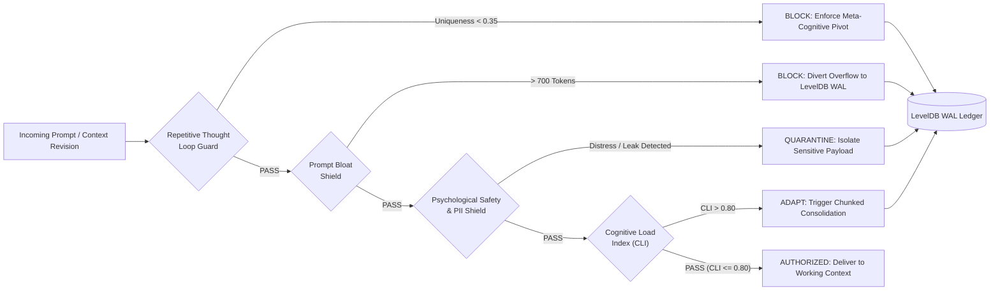

# G-OmniOS Architecture & System Specification

This document details the architectural principles, subsystems, invariant pipelines, and data flows powering **G-OmniOS**.

---

## 🏛️ System Overview

G-OmniOS serves as an out-of-band **Cognitive Operating System** and **Memory Firewall Hub** positioned between client interfaces (IDE extensions, agent frameworks, CLI) and underlying Large Language Models (LLMs).

---

## 🔄 Mind4Action 4-Phase Cognitive Cycle

The **Mind4Action** cognitive engine structures reasoning into four deterministic, accountable stages:

---

## 👥 Organizational Agent Hierarchy & Governance

G-OmniOS deploys six specialized organizational agent teams communicating asynchronously through a shared memory core:

---

## 🛡️ Memory Firewall Invariant Flow

The Memory Firewall Hub evaluates every prompt, step, and context update against strict invariants before allowing token allocation into LLM working memory:

---

## 📊 Token Economics & Context Invariant

In standard unbuffered LLM agent architectures, intermediate chain-of-thought, compiler errors, raw database responses, and API logs accumulate linearly:

$$\text{Tokens}_{\text{Standard}}(N) = \text{BasePrompt} + \sum_{i=1}^{N} \text{StepTokens}_i$$

Under **G-OmniOS**, intermediate steps are routed directly to the LevelDB WAL, leaving the working context bounded:

$$\text{Tokens}_{\text{G-OmniOS}}(N) = \text{BasePrompt} + \Delta_{\text{MyersRevision}} + \text{TopK}_{\text{ScaNN}} \le \text{Budget}_{\text{Max}} \quad (\approx 800\text{ tokens})$$

This delivers consistent **70%–90%+ token cost reductions** and completely prevents long-horizon context degradation.
