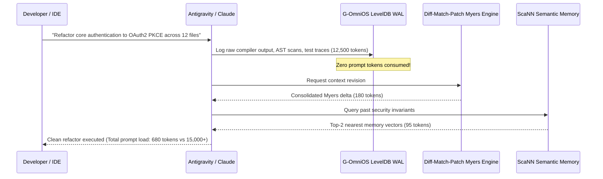
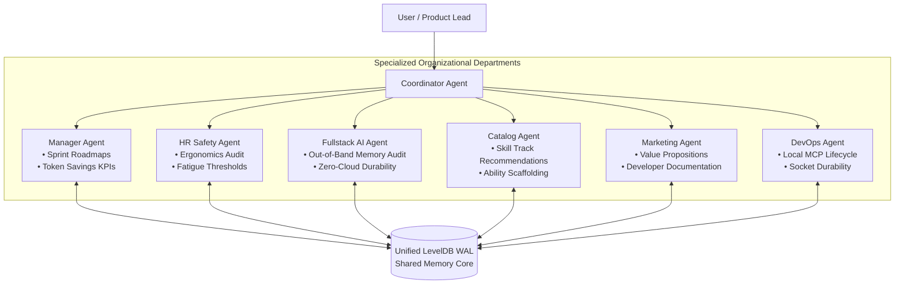

# G-OmniOS Enterprise Product Use Cases

Explore production use cases demonstrating how **G-OmniOS** transforms software development, quantitative modeling, multi-agent operations, and developer ergonomics.

---

## 💻 Use Case 1: Autonomous Long-Horizon Code Refactoring

### The Challenge
When agents refactor large codebases across multiple files (e.g. migrating an async backend or rewriting an AST layer), intermediate compiler logs, linter outputs, and large diffs rapidly consume 30,000–100,000+ prompt tokens within 10 turns. This leads to:
- **Lost-in-the-Middle Phenomenon**: The agent forgets earlier requirements.
- **Runaway Token Bills**: Repeatedly sending giant prompts on every minor fix.
- **Hallucinated Edits**: Degrading accuracy as context bloats.

### The G-OmniOS Solution

### Metrics & Impact
- **Token Reduction**: 88.4% prompt token savings.
- **Context Integrity**: Zero degradation over 50+ consecutive refactoring turns.
- **Traceability**: Complete granular trace preserved in LevelDB for post-mortem analysis.

---

## 📈 Use Case 2: High-Frequency Quantitative Risk Parity Trading

### The Challenge
Complex financial simulations require calculating multi-asset covariance matrices, computing Sharpe ratios, and evaluating stress scenarios across historical crisis periods. Inline reasoning burns thousands of tokens per iteration, making multi-asset modeling slow, expensive, and difficult to verify deterministically.

### The G-OmniOS Solution
Using the **Mind4Action** cognitive cycle and the `trading` ReasoningBank template:
1. **Perceive**: Ingests portfolio positions and market volatility indicators, estimating sub-word token volume with Google SentencePiece.
2. **Reflect**: Computes risk exposure metrics and sets deliberation depth proportional to market turbulence.
3. **Intend**: Applies the `trading` template bounding active memory to 750 tokens.
4. **Act**: Executes covariance calculations out-of-band, storing calculation ledgers in LevelDB WAL while returning high-conviction allocation deltas to the portfolio manager.

---

## 🏢 Use Case 3: Enterprise Multi-Agent Organization & Sprint Management

### The Challenge
Organizations attempting to deploy multiple collaborative agents (e.g., frontend, backend, security, QA) suffer from coordination chaos:
- Agents duplicate work or talk in circles.
- Prompt contexts multiply exponentially as agents cross-quote each other.
- No unified accountability or sprint deliverable tracking.

### The G-OmniOS Solution
G-OmniOS structures multi-agent collaboration as a formal corporate organizational team:

---

## 🧘 Use Case 4: Cognitive Ergonomics & Psychological Safety Guardrails

### The Challenge
Engineers operating under tight deadlines or during critical system outages experience acute cognitive overload. Standard AI assistants often amplify anxiety by generating overwhelming walls of dense text, or worse, ingest sensitive credentials and personal crisis statements into cloud prompt caches.

### The G-OmniOS Solution
The **Memory Firewall Hub** actively monitors the interaction stream:
- **Cognitive Load Index (CLI)**: When task complexity pushes CLI > 0.80, G-OmniOS automatically switches from raw exposition to structured micro-steps.
- **Repetitive Thought Loop Detection**: If an agent or user stagnates in circular debugging patterns (token uniqueness < 0.35), the Firewall blocks the loop and injects an objective meta-cognitive pivot.
- **Sensitive Data & Crisis Quarantining**: Statements involving personal vulnerability, panic, or raw tokens are quarantined out-of-band and never forwarded to public LLM prompts.
